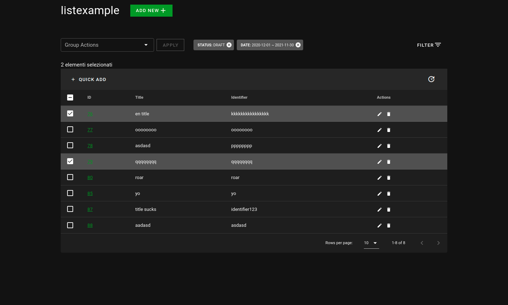

# List

The purpose of this component is to provide you with a very quick way to create a page that can show a list of resources retrieved from the server. A use case example could be "build a page that lists all the products of an ecommerce".    This component is a wrapper and is made up of several parts. The props and slots of this component are passed to its childs. For detailed explanations see [Transparent Wrapping](#transparent-wrapping).    

## Props

<!-- @vuese:List:props:start -->

|Name|Description|Type|Required|Default|
|---|---|---|---|---|
|endpoint|The url of the endpoint that provides the data to display. From this url a complete crud (See [this.$mapo.$api.crud](/core/#$api.crud)) will be created.|`String`|`true`|-|

<!-- @vuese:List:props:end -->

## Events

<!-- @vuese:List:events:start -->

|Event Name|Description|Parameters|
|---|---|---|
|selectionChange|Fires when you select some row of the table.|Emit the list of the selected rows.|

<!-- @vuese:List:events:end -->

## Transparent Wrapping

This component, as we said, is a wrapper and is made up of several parts:
 - [ListActions](../ListActions/)
 - [ListFilters](../ListFilters/)
 - [ListHead](../ListHead/)
 - [ListQuickEdit](../ListQuickEdit/)
 - [ListTable](../ListTable/)

Each component within it inherits its props and slots.

### Props
For the list of available prop refer to the documentation of each single part.

### Slots
This component has not individual slots, but reflects down to its parts each assigned slot. 

Each part can be reached with a namespace.

 - `"filter"` is the namespace of [`ListFilters`](../ListFilters/#slots) slots.
 - `"dtable"` is the namespace of [`ListTable`](../ListTable/#slots) slots.
 - `"qedit"` is the namespace of [`ListQuickEdit`](../ListQuickEdit/#slots) slots.

## Live Example 🕶

::: demo
<template>
<v-app >
  <List
    show-select
    :headers="headers"
    :editFields="editFields"
    :filters="availableFilters" 
    endpoint="api/camomilla/articles"
    title="List Example"
    addItem
  >
  </List>
</v-app>
</template>

:::

